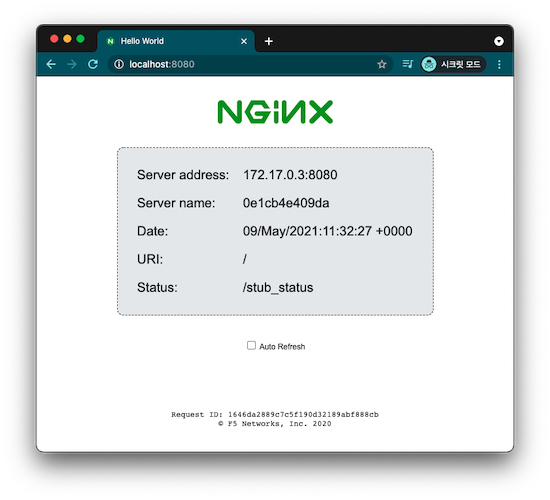
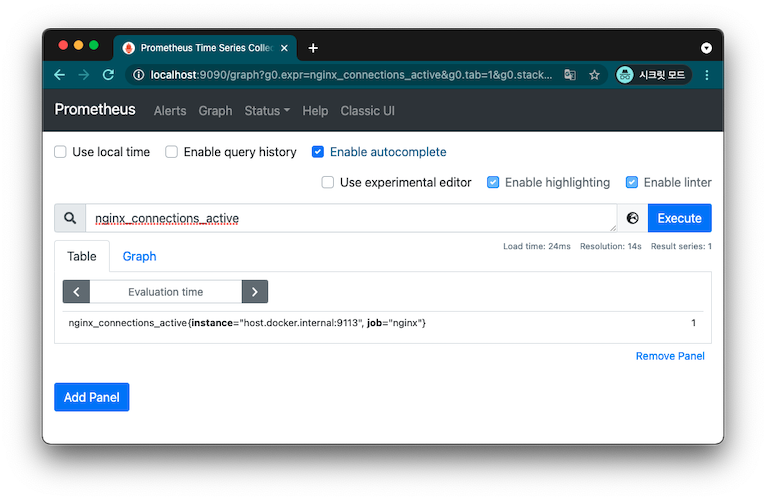

# Module04-1

## Nginx Exporter

### nginx stub_stauts

nginx 모니터링은 stub_status 모듈을 통해 이뤄지는데 configuration에 `stub_status on;`를 추가하고 nginx 서비스를 시작하면 설정한 location URI로 접근하면 간단한 텍스트 통계 정보를 확인할 수 있다.  

### nginx.conf
```
server {
    listen 8080;

    root /usr/share/nginx/html;
    try_files /index.html =404;

    expires -1;

    location /stub_status {
        stub_status on;
    }
}
```

### nginx sample app

stub_status 모듈이 추가된 미리 구성해놓은 Sample app을 실행한다.  

```
docker run -p 8080:8080 ddiiwoong/nginx-hello-stub:0.1
```

간단한 nginx 샘플앱으로 아래와 같이 Server address, name, Date, URI, Status를 보여준다.

[http://localhost:8080](http://localhost:8080)



### /stub_status Page

[http://localhost:8080/stub_status](http://localhost:8080/stub_status)에 접속해서 nginx status 정보를 확인한다.

```
Active connections: 2 
server accepts handled requests
 15 15 210 
Reading: 0 Writing: 1 Waiting: 1 
```

### nginx exporter

NGINX Prometheus Exporter는 NGINX의 [stub_status page](http://nginx.org/en/docs/http/ngx_http_stub_status_module.html#stub_status)와 NGINX Plus의 [API](https://nginx.org/en/docs/http/ngx_http_api_module.html)를 사용하여 메트릭을 expose한다. 

[https://github.com/nginxinc/nginx-prometheus-exporter](https://github.com/nginxinc/nginx-prometheus-exporter)

### nginx exporter 실행

샘플앱에서 Server address를 확인하고 `scrape-uri`에 확인된 address를 입력하고 exporter를 실행한다.

```sh
docker run -p 9113:9113 nginx/nginx-prometheus-exporter:0.9.0 -nginx.scrape-uri=http://<nginx-address>:8080/stub_status
```

[http://localhost:9113/metrics](http://localhost:9113/metrics)에 접속해서 nginx status 정보를 확인한다.

```
curl http://localhost:9113/metrics
# HELP nginx_connections_accepted Accepted client connections
# TYPE nginx_connections_accepted counter
nginx_connections_accepted 20
# HELP nginx_connections_active Active client connections
# TYPE nginx_connections_active gauge
nginx_connections_active 1
# HELP nginx_connections_handled Handled client connections
# TYPE nginx_connections_handled counter
nginx_connections_handled 20
# HELP nginx_connections_reading Connections where NGINX is reading the request header
# TYPE nginx_connections_reading gauge
nginx_connections_reading 0
# HELP nginx_connections_waiting Idle client connections
# TYPE nginx_connections_waiting gauge
nginx_connections_waiting 0
# HELP nginx_connections_writing Connections where NGINX is writing the response back to the client
# TYPE nginx_connections_writing gauge
nginx_connections_writing 1
# HELP nginx_http_requests_total Total http requests
# TYPE nginx_http_requests_total counter
nginx_http_requests_total 252
# HELP nginx_up Status of the last metric scrape
# TYPE nginx_up gauge
nginx_up 1
# HELP nginxexporter_build_info Exporter build information
# TYPE nginxexporter_build_info gauge
nginxexporter_build_info{commit="5f88afbd906baae02edfbab4f5715e06d88538a0",date="2021-03-22T20:16:09Z",version="0.9.0"} 1
```

### prometheus scrape config

prometheus.yml에 nginx target을 추가한다. 
```
  - job_name: nginx
    static_configs:
    - targets: ['host.docker.internal:9113']
```

다시 prometheus 서버를 실행한다.
```
docker run -it -d -p 9090:9090 \
    -v $PWD/prometheus.yml:/etc/prometheus/prometheus.yml \
    --name prometheus-server \
    prom/prometheus
```

`nginx_connections_active`을 포함한 nginx 관련 메트릭을 확인할 수 있다.  



## Pushgateway

```sh
docker run -d -p 9091:9091 prom/pushgateway
```
### metrics 확인
[http://localhost:9091/metrics](http://localhost:9091/metrics)

### prometheus scrape config

prometheus.yml에 nginx target을 추가한다.  
`honor_labels: true`는 Pushgateway가 expose하는 모든 레이블을 보존하려는 경우에 사용한다.

```
  - job_name: pushgateway
    honor_labels: true
    static_configs:
    - targets: ['host.docker.internal:9091']
```

다시 prometheus 서버를 실행한다.
```
docker run -it -d -p 9090:9090 \
    -v $PWD/prometheus.yml:/etc/prometheus/prometheus.yml \
    --name prometheus-server \
    prom/prometheus
```

### pushgateway metric 확인

`pushgateway_build_info`로 pushgateway 빌드 정보를 알수 있다. 

### push custom metric

-data-binary @- flag로 메트릭 정보를 인자로 넘긴다.

```
echo "pi_metric 3.14" | curl --data-binary @- http://localhost:9091/metrics/job/some_job
```


{job="some_job",instance="some_instance"} label을 가지는 counter와 gauge를 push 한다. 

```
cat <<EOF | curl --data-binary @- http://localhost:9091/metrics/job/some_job/instance/some_instance
# TYPE steps counter
# HELP steps is number of walk steps
steps{label="applewatch"} 4340
# TYPE pulse gauge
# HELP pulse is heart rate
pulse 89
EOF
```

Push metric을 확인할수 있다.

```
curl http://localhost:9091/metrics
... 
pulse{instance="some_instance",job="some_job"} 89
...
steps{instance="some_instance",job="some_job",label="applewatch"} 4340
```

